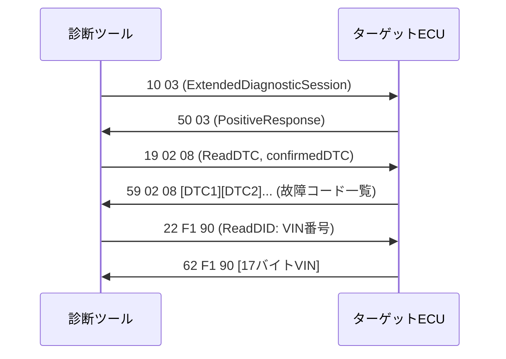

## 概要
UDS(Unified Diagnostic Services、ISO 14229)は、ECUを診断・プログラムするための標準プロトコルです。「**サービスID**」と呼ばれる命令コードで、故障コード(DTC)の読み出し、メモリへの書き込み、ECUのリセットなどを行います。

## なぜ必要か
車両には数十〜百を超えるECUが搭載されており、それぞれのメーカー独自プロトコルでは診断機器の対応コストが爆発します。UDSは共通言語として、工場・販売店・開発者が同じ手順でECUを診断できる仕組みを提供します。

## 主なサービス
- **0x10** DiagnosticSessionControl — **診断セッション**の切り替え(デフォルト/拡張/プログラミング)
- **0x11** ECUReset — ECUのリセット
- **0x19** ReadDTCInformation — 故障コードの読み出し
- **0x22** ReadDataByIdentifier(DID) — センサ値・設定値の読み出し
- **0x2E** WriteDataByIdentifier — 設定値の書き込み
- **0x34/0x36/0x37** RequestDownload/TransferData/RequestTransferExit — ファームウェア書き換え

## 自動運転での利用例
ADAS ECUの開発中、カメラやLiDARのキャリブレーションパラメータをUDS 0x2Eで書き込みます。また走行テスト後にADAS故障コードをUDS **0x19**で読み出し、誤検知や通信エラーの原因を特定します。[[doip]] を使えばEthernetケーブル1本でUDS診断が可能です。

## 関連用語
UDSの転送路として [[doip]](Ethernet経由)や [[can]] が使われます。TCP/IP上の接続管理には [[socket]] が必要です。

## 次に学ぶべき内容
EthernetでUDSを運ぶ仕組み、[[doip]] を学びましょう。

## 図解

