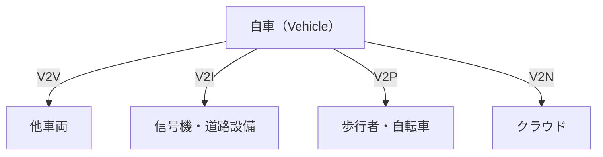

## 概要
V2X（Vehicle-to-Everything）は車と「あらゆるもの」が通信する技術です。車車間（V2V）・車路間（V2I）・車人間（V2P）・車クラウド（V2N）からなり、信号情報取得・衝突回避・自動運転の重要インフラです。DSRC（専用狭域通信）とC-V2X（セルラーV2X）の2方式があります。

## V2X の種類と応用

V2Xは通信相手によって4種類に分かれます。安全に関わるV2V/V2Pほど低遅延が求められます。

| 種類 | 通信相手 | 主な用途 | 要求遅延 | 通信距離 |
|---|---|---|---|---|
| V2V | 他車両 | 前方衝突警告・緊急ブレーキ通知・死角検出 | < 100ms | 300〜1000m |
| V2I | 信号機・道路設備 | 信号情報(SPAT)・速度勧告・工事情報 | < 100ms | 300〜1000m |
| V2P | 歩行者のスマホ | 横断歩行者警告・自転車接近警告 | < 50ms | 100〜200m |
| V2N | クラウド | HDマップ更新・交通情報・OTA | < 1000ms | 全国（セルラー） |

## DSRC（専用狭域通信）/ IEEE 802.11p

DSRCは5.9GHz帯を使う車載専用の無線で、Wi-Fiを車両向けに改良したものです。**接続確立なし（OCBモード）** で即座にブロードキャストできるため、遅延が非常に小さいのが特徴です。

| 項目 | 仕様 |
|---|---|
| 周波数帯 | 5.9 GHz（5850〜5925 MHz） |
| 帯域幅 | 10 MHz チャンネル（75MHz帯を分割） |
| 変調方式 | OFDM（IEEE 802.11a 準拠） |
| 最大速度 | 27 Mbps |
| 遅延 | < 2ms（接続確立不要） |
| 到達距離 | 300〜1000m（見通し） |
| 採用地域 | 日本（ETC2.0）、米国（WAVE）、EU（ITS-G5） |

## BSM（Basic Safety Message）

V2Vの中心は**BSM**（基本安全メッセージ、SAE J2735規格）です。各車が自分の位置・速度・進行方向・加速度などを **10Hz（100msごと）** にブロードキャストし、周囲の車がそれを受信して危険を判断します。

| BSMに含まれる主な情報 | 内容 |
|---|---|
| 一時ID | プライバシー保護のため随時変わる匿名ID |
| 位置 | 緯度・経度・標高 |
| 速度・進行方向 | 現在の速度とヘディング |
| 加速度・ブレーキ状態 | 急減速の検知に使う |
| 車両サイズ | 幅・長さ |

IDを固定せず随時変える設計により、車両を継続追跡されないようプライバシーが守られています。

## C-V2X（Cellular V2X）vs DSRC

C-V2Xは携帯電話技術（3GPP）をベースにしたV2Xで、基地局を介さず車同士が直接通信する**サイドリンク（PC5）** と、セルラー網経由（V2N）の両方を使えます。

| 項目 | C-V2X (PC5) | DSRC (802.11p) |
|---|---|---|
| 規格 | 3GPP Rel.14/16 | IEEE 802.11p / ITS-G5 |
| 周波数 | 5.9GHz or LTE | 5.9GHz専用 |
| 接続確立 | 不要（ブロードキャスト） | 不要（OCB） |
| 遅延 | < 5ms（理論） | < 2ms（実績） |
| 距離 | 〜500m | 〜1000m |
| セルラー連携 | 容易（V2N統合） | 別途LTE/5G必要 |
| 将来性 | 5G NR-V2X へ発展 | ITS-G5で継続 |

C-V2Xは5G NR-V2Xへ進化する将来性が、DSRCは実績と低遅延が強みで、地域・メーカーによって採用が分かれています。

## V2X の安全ユースケース：前方衝突警告

代表例が **FCW（Forward Collision Warning）** です。前方車のBSMから相対速度と車間距離を得て、**衝突予測時間（TTC: Time To Collision）** を計算します。

$$\text{TTC} = \frac{\text{車間距離}}{\text{相対速度}}$$

TTCが短いほど危険です。あわせて、自車が止まりきれる**安全車間距離**も評価します（制動距離＋反応距離、\(a\) は減速度）。

$$d_{\text{safe}} = \frac{v^2}{2a} + v \times t_{\text{reaction}}$$

| 状況 | 判定 |
|---|---|
| TTC < 1.5秒 | 🔴 緊急警告（衝突直前） |
| 車間 < 安全距離 | 🟡 注意（車間不足） |
| それ以外 | 🟢 安全 |

カメラやレーダーと違い、V2Xは**見通しの効かない交差点や前方車の陰**でも相手の動きを把握できるのが最大の利点です。
