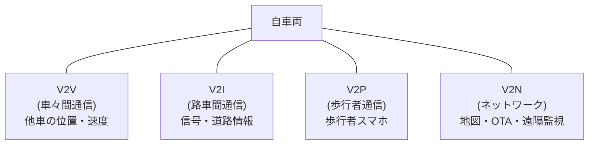

## 概要
V2X(Vehicle-to-Everything)は、車両が道路インフラ・他車・歩行者・クラウドとリアルタイムに情報を交換する無線通信の総称です。V2V(車々間)、V2I(路車間)、V2P(歩行者)、V2N(ネットワーク)に分類されます。

## なぜ必要か
カメラやLiDARは「見える範囲」しか認識できませんが、V2Xは見通し外の情報(交差点の対向車、信号の切り替えタイミング)を事前に取得できます。人間の反射速度を超える数百ms先の危険回避を可能にし、ADAS・自動運転の安全性を根本から向上させます。

## 主な技術方式
- **DSRC / IEEE 802.11p (WAVE)** — 5.9 GHz帯、低遅延(< 10 ms)、インフラ不要のアドホック通信
- **C-V2X (Cellular V2X)** — LTE/5G基地局を利用、広域カバレッジ、サービス品質保証
- **5G NR-V2X** — 超低遅延・高信頼で自動運転レベル4以上を想定

## 主なユースケース
- **ETSI ITS / SAE J2735** 標準メッセージ: CAM(位置・速度)、DENM(危険警告)
- 交差点での出会い頭衝突防止(V2I信号情報)
- 緊急車両接近通知(V2V)
- 路面状況・落下物情報の共有(V2N)

## 自動運転での利用例
自動運転レベル4以上では、センサだけでなくV2Xによる協調認識が安全マージンを大幅に向上させます。信号情報活用(GLOSA)により、最適速度で信号を通過して燃費改善も実現します。

## 関連用語
V2X通信のセキュリティには [[cybersecurity]] の理解が必須です。パケット転送の基盤は [[udp]] / [[ip]] です。

## 次に学ぶべき内容
V2X通信を含む車載ネットワーク全体のセキュリティ、[[cybersecurity]] を学びましょう。

## 図解

