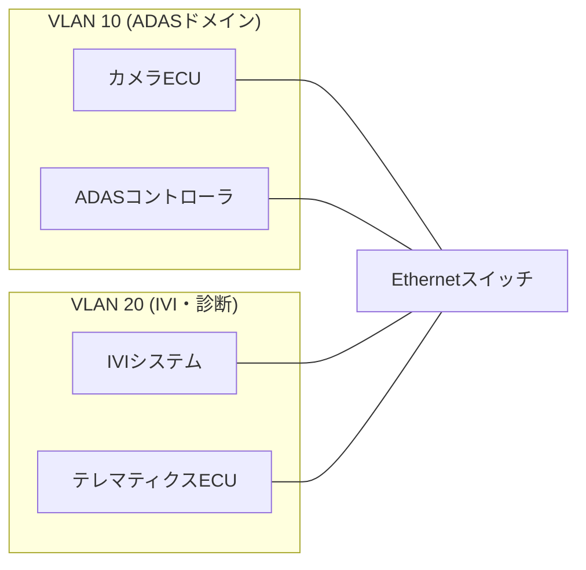

## 概要
VLAN(Virtual LAN / IEEE 802.1Q)は、1本の物理 [[ethernet]] を論理的に複数のネットワークに分割する技術です。フレームに「VLANタグ」を付けることで、同じケーブル上でもグループごとに通信を分離できます。

## なぜ必要か
1つの物理網に異なる目的のトラフィックが混在すると、セキュリティやリアルタイム性に問題が出ます。VLANで論理的に分けることで、不要な通信の混入を防ぎ、帯域と安全性を確保できます。

## 自動運転での利用例
車載Ethernetでは、制御系・情報系(インフォテインメント)・診断系などをVLANで分離するのが一般的です。これにより、映像ストリームが制御通信を圧迫するのを防ぎ、安全に関わるトラフィックを保護します。

## 関連用語
土台が [[ethernet]]、宛先識別が [[mac-address]]、時間保証と組み合わせる技術が [[tsn]] です。

## 次に学ぶべき内容
リアルタイム性を保証する [[tsn]] を学びましょう。

## 図解

