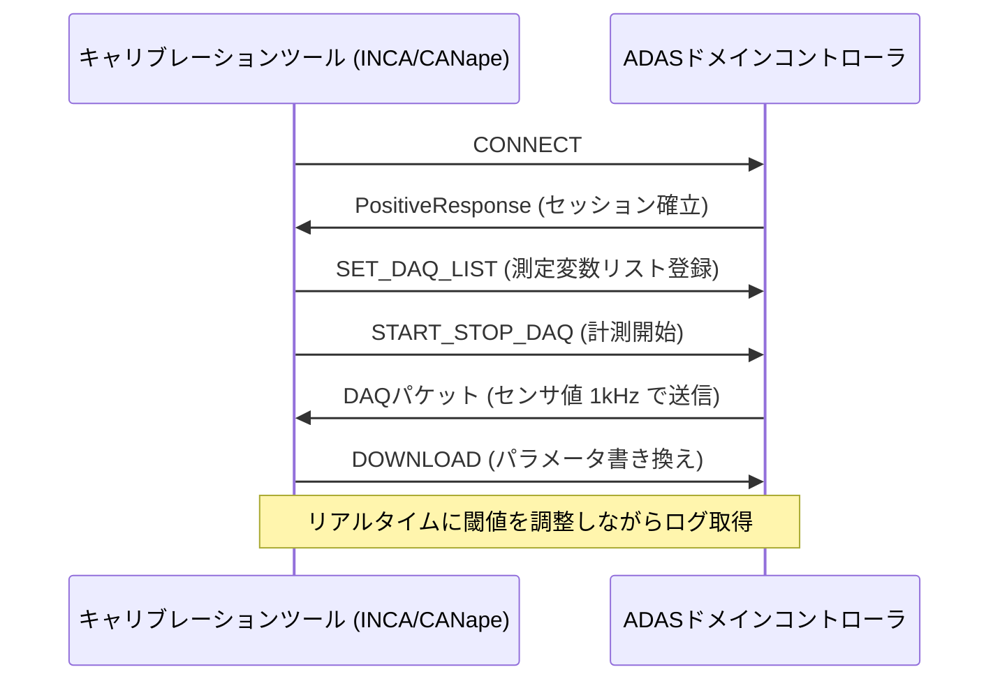

## 概要
XCP(Universal Measurement and Calibration Protocol、ASAM MCD-1 XCP)は、ECU内部の変数をリアルタイムに測定・書き換えするためのプロトコルです。開発中のECUに対してキャリブレーションツール(INCA、CANape等)から接続し、センサゲイン・制御パラメータをオンザフライで調整します。

## なぜ必要か
ADAS・エンジン制御のパラメータは数千〜数万に及び、都度ファームウェアを焼き直していたら開発期間が爆発します。XCPは実行中のECUメモリに直接アクセスし、ループを回しながらパラメータを調整できるため、HILシミュレーションや試験車両での開発効率を劇的に向上させます。

## 仕組み
マスター(PC側ツール)がスレーブ(ECU)に CONNECT コマンドを送り、セッションを確立します。その後：
- **DAQ (Data Acquisition)** — ECU変数を一定周期でPCへ送信
- **STIM (Stimulation)** — PC側からECUに変数を書き込む
- **SET_CAL_PAGE / COPY_CAL_PAGE** — キャリブレーションページの切り替え

## 転送路
XCPはトランスポート層を選ばない設計で、CAN(XCP on CAN)、Ethernet(XCP on UDP/TCP)、USB、FlexRayに対応します。近年の高性能ECUではXCP on Ethernetが主流です。

## 自動運転での利用例
ADAS Domain Controllerの物体認識閾値・センサフュージョン重みをXCPで実車走行中にリアルタイム調整し、ログを取りながら最適パラメータを探索します。[[uds]] が量産診断向けなのに対し、XCPは開発・テスト工程専用です。

## 関連用語
量産診断は [[uds]]、転送基盤は [[udp]] / [[ethernet]] または [[can]] を使います。

## 次に学ぶべき内容
量産診断の標準プロトコル [[uds]] と比較して理解を深めましょう。

## 図解

